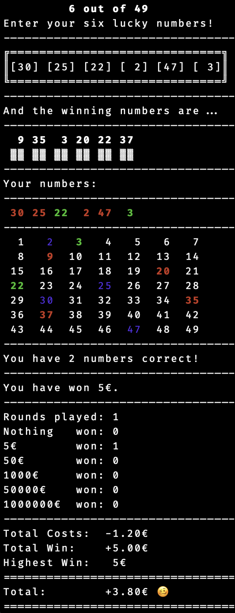

# HAW PR Lab 3

These are possible solutions to the PSET of lab 3.

I divided them into two separate versions:

1. Simple
1. Insane (Open at your own risk)

## Version explanation

Each version has a different level of complexitiy. Some elements are not included in all versions.

### STATUS

## Simple

work in progress

## Insane

<!--  -->

